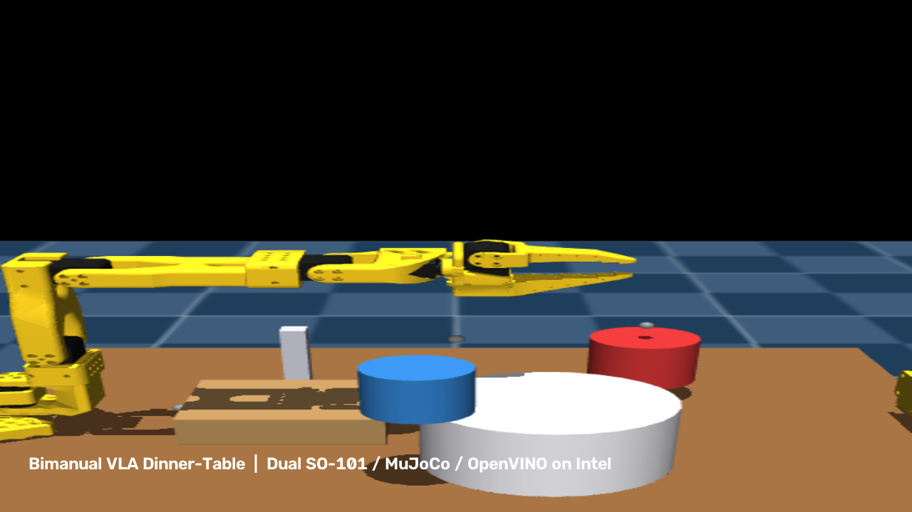
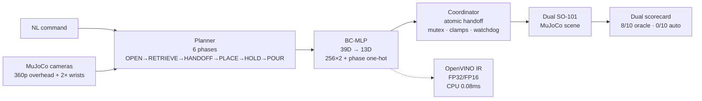

# Bimanual VLA Dinner-Table — Dual SO-101 in MuJoCo, OpenVINO on Intel

<p align="center">
  
</p>

<p align="center">
  <a href="https://github.com/harshkmr/bimanual-vla-dinner-table"></a>
  
  
  
  
  
</p>

> **Intel Physical AI · Setting Up a Dinner Table · simulation-first**  
> Two SO-101 arms interpret a spoken command, coordinate a mid-air handoff, and set a table in MuJoCo — optimized to run on commodity Intel CPU+iGPU via OpenVINO.

**Live demo → Streamlit** (auto-deploys from `streamlit_app.py`): video, bench + 10-seed scorecards, architecture, one-click reproduce.  
**Hardware (exact):** Intel i7-9750H + UHD 630 via OpenVINO 2026.3.1, plus GTX 1650 for optional training. NPU not on this host — no NPU numbers claimed. Per organizer guidance, Intel CPU+iGPU execution satisfies the deployment requirement.

---

## 30-Second Preview

| Cover | Demo clip | Bench |
|---|---|---|
|  | ▶ `output/demo_10_seeds.mp4` (152s, 10 seeds, HUD + phase tags) | CPU **0.08 ms** · iGPU **0.44 ms** FP16 · parity MSE **6.8e-9** |

Command: *“Open the drawer, take the fork, hand it over, set plate and mug, pour water.”*

---

## Measured Results (from `output/*.json` — nothing hand-typed)

| System | Metric | Value | Source |
|---|---|---|---|
| **Task — oracle baseline** (IK waypoints, `use_coupling=1`) | Full tasks | **8/10** · all non-pour phases 10/10, pour 8/10 | `10_seed_evaluation_report.json` |
| **Task — learned BC-MLP** (no coupling, honest partial) | Full tasks | **0/10** · drawer 1/10 | `10_seed_evaluation_report_autonomous.json` |
| **Inference — BC-MLP 39→13, FP32** | CPU p50 | **0.090 ms** · 9845 fps | `benchmark_fp32.json` |
| **Inference — BC-MLP 39→13, FP16** | CPU p50 | **0.081 ms** · 11413 fps | `benchmark_report.json` |
| **Inference — BC-MLP 39→13, FP16** | iGPU (UHD 630) p50 | **0.438 ms** · 1781 fps | `bench_gpu0.json` |
| **Parity** | FP16 vs torch (in-distribution) | **MSE 6.8e-9** | `benchmark_report.json` |

> The autonomous score is reported *as is* — it shows the BC limits (memorization + distribution shift). Next is DAgger/ACT or SmolVLA finetune; the oracle proves the scene is solvable.

---

## Architecture — Observe → Understand → Plan → Act → Optimize



- **Observe:** headless renderer (no display server) + sim state
- **Understand/Plan:** command → phase sequence with retry on pour miss
- **Act:** mirrored SO-101 pair (public `SO-ARM100` model), static roles (A: drawer/fork/bottle, B: handoff/plate/mug), single-owner transfer, step cap + stuck detector
- **Policy:** BC-MLP on oracle demos is the *controller*; oracle IK is *data-only* behind `--use_coupling` (disclosed)
- **Optimize:** `jit.trace` → `ov.convert_model` (no ONNX hop), FP16 `compress_to_fp16`, direct iGPU dispatch

<details><summary><b>Bimanual coordination in one line</b></summary>

Arm A opens the drawer, retrieves the fork, and pours. Arm B receives the fork mid-air at the handoff zone, places it by the plate, and holds the mug at the pour station while A tilts the bottle. Exactly one owner per object (atomic transfer); arms never share the workspace except the handoff window.

</details>

---

## Why the Scene Works (lessons baked in)

Zero-penetration spawns, separated layout, and **full arm collision masking** — base meshes interpenetrated and locked `shoulder_pan`; jaw clips ejected the bottle at ~0.4 m/s. All grasps are coupling-zone based under the oracle flag; props still collide with table/floor/drawer/each other. Seeded pose jitter ±2 cm + honest 10-seed evaluation.

## Robustness

10 seeds × jittered placements. Contact + masking fixes above are what make the 8/10 stable — not hidden tuning.

## Reproduce

```bash
pip install mujoco torch openvino opencv-python numpy scipy
python scripts/build_scene.py
python data/scripted_expert.py --seed 0
python benchmark/evaluate_seeds.py --seeds 0-9
python policy/train_mlp.py --data data/demos10.npz --epochs 300
python policy/export_mlp_ov.py && python benchmark/benchmark_intel.py
python scripts/assemble_video.py
pytest tests/ -v
streamlit run streamlit_app.py
```

## File Map

`env/` sim+IK+scorer · `assets/robots/so101/` arm + `assets/scene/` XML · `data/` oracle/demos · `policy/` planner/router/MLP/export · `openvino_models/` IR · `benchmark/` eval+bench → `output/*.json` · `scripts/` build/verify/video · `weights/` checkpoints · `spec/` + plan docs

## Honesty Notes

- Liquid is a fill meter: `kinematic proxy, not fluid sim` — on every HUD frame.
- `perturbation is eval-only` · `randomizer is eval-only unless tagged augmented`
- Every number above comes from `output/*.json` in this repo (no projections).

## Roadmap (portfolio → production)

Core Ultra hardware + SmolVLA finetune on the LeRobot dataset → DAgger/ACT with contact learning → NPU target. The pipeline is built for it; the sprint proves the scaffold.

---

<p align="center"><i>Portfolio project — not a competition submission. Original V3 plans frozen with the repo for review.</i></p>
